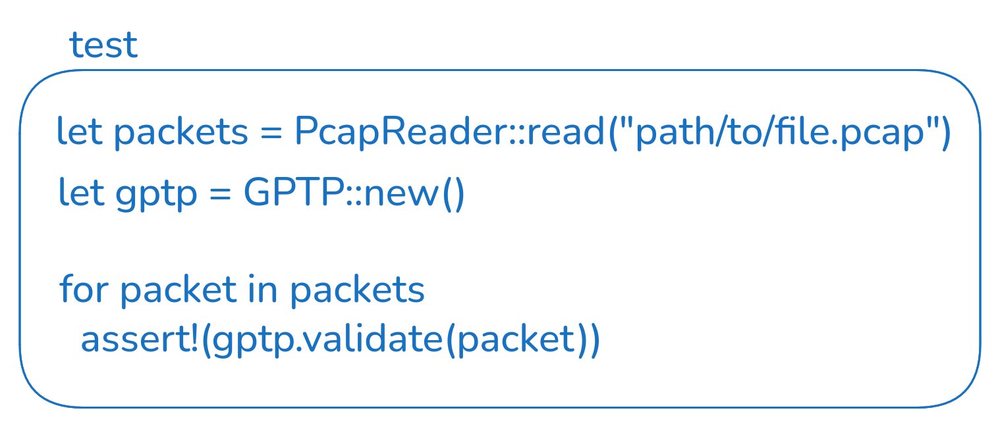

# `trigerror`

A small utility app with a CLI for monitoring network traffic and creating recordings with error logs upon detecting
a protocol error in a packet.

# Requirements

## Install Rust

Make sure that [Rust](https://rust-lang.org/) is installed on your system. If not then go to
[`rustup`](https://rustup.rs/) and follow the installation instructions.

> It is most likely going to be this command but double check on the website to be sure:
>
> ```bash
> curl --proto '=https' --tlsv1.2 -sSf https://sh.rustup.rs | sh
> ```

## Install `just`

> ### Note
> [`just`](https://just.systems/) is not strictly required. It is provided for convenience.
> If you don't want to install it it is sufficient to run
> ```bash
> cargo build
> ```
> or
> ```bash
> cargo build --release
> ```
> respectively. The compiled binaries can be found in `target/debug/trigerror` or `target/release/trigerror`
> respectively.

This project provides a [`justfile`](https://just.systems/man/en/quick-start.html) for convenience.
It runs a series of commands in order so that you don't have to type it all out every time.
If you have installed Rust on your system you can install it simply with:

```bash
cargo install just
```

# Compile from Source

To build `trigerror` in debug mode, run
```bash
just build-dev
```

To build `trigerror` in release mode, run
```bash
just build
```

Both of these commands will place the final binary in `bin` for convenience.
The name of the binary will be appended with the protocol name and version. (This might change in the future)
The original binary is located in `target/debug` or `target/release` respectively.
(The `target` directory only appears once `cargo` starts compiling.)

You can also install the `trigerror` executable to `/usr/bin` by running:
```bash
just install
```

## Clean up Build Artifacts
After `cargo` is done compiling it is advisable to remove the build artifacts for the `target` folder can become
several GB in size. For that simply run:

⚠️ This will also remove the binaries from the `bin` folder.
```bash
just clean
```

If you want to keep the contents of the `bin` folder simply run:
```bash
cargo clean
```

# Roadmap
1. Async timer to detect missing packets (packet never arrives) and to finish writing to file.
  This requires a time driven approach instead of an event driven approach. Timer sends signal every second.
  (observer pattern) (Qt signals and slots)
1. intona ethernet tap
1. domains for each gPTP message. should be a simple hashmap: domain_id -> (state machines)
1. implement verification for the remaining packets so that gPTP is implemented more or less completely
1. capture on multiple interfaces. one thread for each interface
  - an error on one interface triggers a recording on all interfaces
## More Distant Goals
- small dashboard in the console with size of buffer, amount of errors recorded, etc.
- more protocols. select which protocol(s) should trigger a recording

---

---

---

# Consider creating a generic `enum` with an `Uninitialized` variant and use it where it makes sense. Or just use an `Option`.

- TODO: to verify the correctness of the protocol, create small test `.pcap` scenarios (3-10 packets) and let the `GPTP` verify
  them like so:
  
- TODO: create tests. for that create `PcapPackets` and a `GPTP` validator, one by one feed the `PcapPacket`s to the `GPTP`
  validator and verify that the correct error messages are returned.
- TODO: Intona Ether Tap is a tap device. Consider using [tappers](https://crates.io/crates/tappers)
- TODO: document: abstract -> concrete (not too far into details) -> abstract
- TODO: define scope better (10 GB/s links are out of scope)
- TODO: `logMessageInterval` only for:
  - synce1step
  - sync2step
  - signaling (with `gptp_capable`, otherwise that's an error)
  - peer_delay_request
  - announce
- TODO: handle `logMessageInterval == 126 || 127 || 128` in all message types
- TODO: maybe it would be a good idea to create a `struct PacketState` where all possible errors are set as one big bitfield?
- TODO: logo
- TODO: calculate filesize from captured packets
- DONE: for writing `.pcapng` files, 2 crates are of interest: `pcapng-writer` and `pcap-file`
- NOTE: https://biot.com/capstats/bpf.html
- NOTE: [intona ethernet tap source code](https://github.com/intona/ethernet-debugger#readme)
- NOTE: https://intona.eu/en/doc/ethernet-debugger/#IN3032UG:EthernetDebuggerUserGuide-Linux,macOS
- SOLL-ZIEL: store data as `.pcapng` files
- NOTE: linkspeed
- TODO: calculate size of buffer (important if operating on RPi with max RAM of 8GB) (constrained memory environment)
- NOTE: param prio: 1. time 2. memory size 3. packet count. if no more memory, trim start of error
- TODO: consider some logging library: https://docs.rs/log/latest/log/
- TODO: in the BA paper link to dependencies directly
- TODO: abstract auch noch mehrwert und was dabei rauskam (wichtigsten ergebnisse)
- TODO: make use of [`PcapParser`](https://docs.rs/pcap-file/latest/pcap_file/pcap/struct.PcapParser.html)

## Useful resources
- [Rust `async`](https://doc.rust-lang.org/book/ch17-00-async-await.html)
- [an alternative way to handle `enum`s using generics](https://stackoverflow.com/questions/72438594/how-can-i-use-enum-variants-as-generic-type#answer-72438660)
- [Rust parallelism](https://www.youtube.com/watch?v=AiSl4vf40WU)
- [PTP](https://en.wikipedia.org/wiki/Precision_Time_Protocol)
- [config directory in OS](https://docs.rs/dirs/latest/dirs/fn.config_dir.html)
- [Rust `pcap` crate](https://docs.rs/rpcap/latest/rpcap/)
- [Rust `cli` help](https://rust-cli.github.io/book/index.html)
- https://stackoverflow.com/questions/28823788/how-do-i-clear-the-current-line-of-stdout
- https://stackoverflow.com/questions/2388090/how-to-delete-and-replace-last-line-in-the-terminal-using-bash
- https://stackoverflow.com/questions/1953300/how-to-send-pcap-file-packets-on-nic
- [EtherType](https://en.wikipedia.org/wiki/EtherType#Values)
- [write to file](https://www.reddit.com/r/learnrust/comments/ggge3j/what_is_the_proper_way_in_rust_of_writing_into_a/)
- [pcap file format](https://www.endace.com/learn/what-is-a-pcap-file)
- [UNIX epoch converter](https://www.epochconverter.com/)
- [ZHAW Overleaf template](https://www.overleaf.com/latex/templates/zhaw-thesis-template-v2-dot-0/dgmxrbjjwsgy)
- state machine libraries
  - https://github.com/titanclass/edfsm
  - https://github.com/eugene-babichenko/rust-fsm
  - https://github.com/mdeloof/statig
  - https://crates.io/search?q=finite%20state%20machine
- [state machine pattern for Rust](https://refactoring.guru/design-patterns/state/rust/example)
- [intona ethernet tap](https://intona.eu/en/products/ethernet-debugger)

## References
- [`struct timeval` fields meaning](https://man7.org/linux/man-pages/man3/timeval.3type.html)
